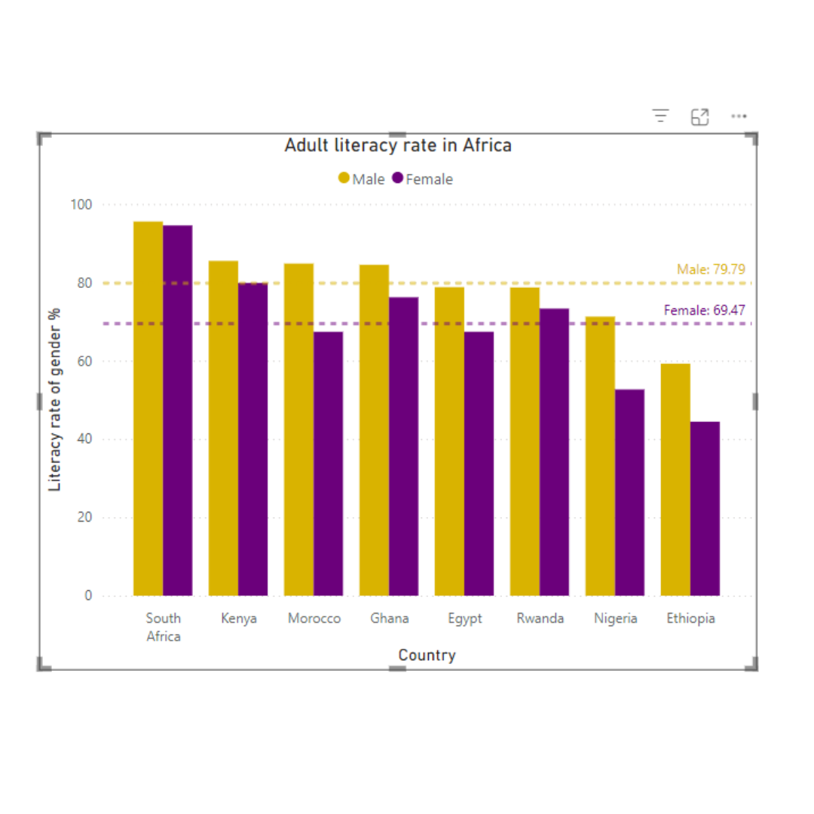

# Kenya and Nigeria: Literacy Levels Comparison  

## Overview  
This visualisation highlights the surprising disparities between Kenya and Nigeria in literacy rates and rural populations. Through two simple visualizations created with PowerBi, I explored how government policies and population dynamics influence educational outcomes.  

## Key Insights  
- Rural Population: Kenya has a higher rural population than Nigeria, despite its smaller overall population (50M vs. 200M).  
- Literacy Rate: Kenya outperforms Nigeria in literacy, ranking second in Sub-Saharan Africa as of 2022.  
  - Kenya introduced free and compulsory primary education in 2003, significantly improving literacy over time.  
  - Nigeria faces systemic education challenges, including funding issues, university strikes, and a high number of out-of-school children.

## Tools  
- Dataset: Provided by ALX, featuring population and literacy data.  
- PowerBi: Used to create two simple column charts for visualizing key comparisons.  

## Reflection  
This exercise demonstrates how even basic visualizations can:  
- Challenge biases, such as associating urban centres with national trends.  
- Tell impactful stories that reveal policy successes and failures.  
- Inspire curiosity and deeper exploration of data-driven narratives.  

